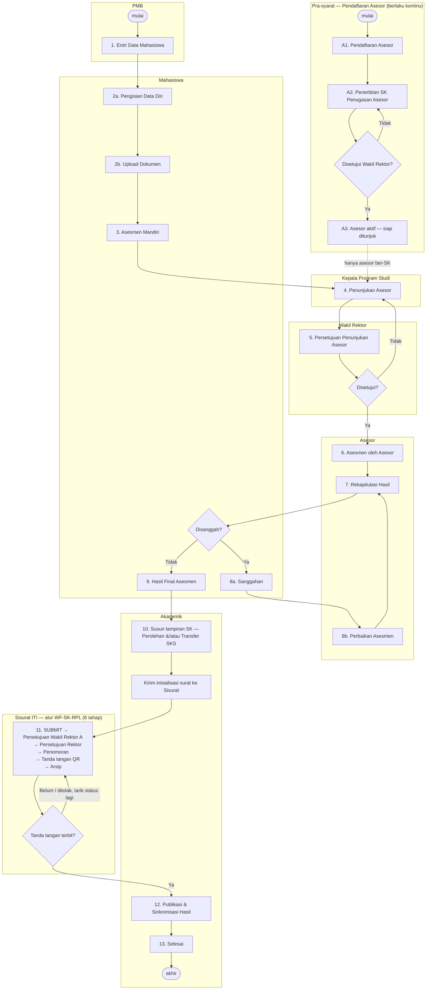

# Alur Proses RPL — Sistem Informasi RPL Terpadu ITI

Dokumen ini merangkum alur bisnis Rekognisi Pembelajaran Lampau (RPL) sebagaimana
**yang benar-benar diimplementasikan di kode**, bukan sekadar rancangan. Setiap tahap
dipetakan ke: aktor, halaman, aksi di UI, data yang tersimpan, dan status yang dihasilkan.

Sumber utama penelusuran:

- `src/components/proses-bisnis/ProsesBisnisComponent.tsx` — diagram proses bisnis resmi
- `src/app/api/protected/status/route.ts` — mesin status (13 tahap)
- `src/services/Status/StatusService.tsx` — pemicu perpindahan status
- `prisma/schema.prisma` — model data
- `src/stores/MenuStore.tsx` — pemetaan peran ↔ menu
- `doc/panduan-api-nomor-surat.md` — API nomor surat Sisurat ITI
- `doc/panduan-integrasi-nextjs.md` — API QR Code Generator ITI

---

## 1. Aktor

| Peran | Tanggung jawab utama |
|---|---|
| **PMB** | Entri data calon mahasiswa RPL (titik awal seluruh proses) |
| **Mahasiswa** | Melengkapi data diri, unggah dokumen bukti, memilih mata kuliah, evaluasi mandiri, mengajukan sanggahan |
| **Kaprodi** | Mendaftarkan asesor dan menunjuk 2 asesor untuk tiap pendaftaran |
| **Wakil Rektor** | Menyetujui SK penugasan asesor, penunjukan asesor, dan hasil final asesmen |
| **Akademik** | Menerbitkan SK penugasan asesor & SK hasil asesmen, sinkronisasi, penutupan |
| **Rektor** | Menandatangani SK hasil asesmen secara elektronik (QR verifikasi) |
| **Asesor** | Menilai bukti per capaian pembelajaran, ekuivalensi transfer SKS, rekapitulasi |
| **Admin** | Master data (prodi, mata kuliah, capaian, jenis dokumen, status, role, template) |

Satu berkas proses = satu baris **`Pendaftaran`** (`pendaftaran_id`). Seluruh status,
dokumen, mata kuliah, dan SK menggantung pada entitas ini.

---

## 2. Diagram Alur



---

## 3. Mesin Status

Status pendaftaran disimpan di `status_mahasiswa_assesment_history` (relasi ke
`status_mahasiswa_assesment`), dengan tepat satu baris ber-`Aktif = true`.

Perpindahan status dilakukan lewat satu endpoint: **`GET /api/protected/status?p=<PendaftaranId>&j=<kode>`**.
Perilakunya (lihat `src/app/api/protected/status/route.ts`):

1. Kode `j` menentukan **daftar status kumulatif** sampai tahap tersebut.
2. Status yang belum ada akan dibuat; status terakhir ditandai `Aktif = true`.
3. **Status yang urutannya melewati tahap target akan dihapus** — inilah mekanisme mundur
   (rollback) ketika sebuah pengajuan ditolak.
4. Status yang tidak lagi ada pada daftar urutan (mis. "Penerbitan SK Penugasan Asesor" yang
   kini dipindah ke pendaftaran asesor) ikut dibersihkan dari riwayat berkas lama.

Ke-12 status dan pemicunya:

| # | Status | Kode `j` | Dipicu oleh | Dari halaman |
|---|---|---|---|---|
| 1 | Pengisian Data Diri | `pdd` | PMB menyimpan calon mahasiswa baru | `/manajemen-data/mahasiswa` |
| 2 | Asessmen Mandiri | `am` | Mahasiswa menekan "Mulai Evaluasi" | `/mata-kuliah/evaluasi-mandiri` |
| 3 | Penunjukan Asesor | `pa` | Mahasiswa menekan "Lanjutkan ke Asesor" | `/mata-kuliah/finalisasi` |
| 4 | Persetujuan Penunjukan Asesor | `ppa` | Kaprodi menyimpan Asesor 1 & 2 | `/asesor/penunjukan-asesor` |
| 5 | Asessmen Oleh Asesor | `aoa` | Wakil Rektor menyetujui penunjukan asesor | `/approval/asesor` |
| 6 | Rekapitulasi Asessmen | `ra` | Asesor menekan "Lanjutkan ke Rekapitulasi" | `/asessment/asessmen-mahasiswa` |
| 7 | Sanggahan | `s` | Asesor menekan "Lanjutkan ke Sanggahan" | `/asessment/rekapitulasi` |
| 8 | Hasil Final Asessmen | `hfa` | Sanggahan ditutup | `/asessment/sanggahan-mahasiswa/[id]` |
| 9 | Penerbitan SK Asessmen | `psa` | Berkas masuk ke Akademik untuk disiapkan SK-nya | `/asessment/hasil-asessmen/[id]` |
| 10 | Proses SK di Sisurat | `pss` | Akademik menekan "Tandai Diproses di Sisurat" setelah SK diinisialisasi | `/asessment/hasil-asessmen/[id]`, `/asessment/sk-rektor/[id]` |
| 11 | Sinkronisasi Hasil Asessmen | `sha` | Seluruh SK sudah bernomor resmi dari Sisurat dan dipublikasikan Akademik | `/asessment/sk-rektor/[id]` |
| 12 | Selesai | `done` | Akademik menjalankan sinkronisasi | `/asessment/sinkronisasi` |

Setiap perubahan status otomatis menjadi notifikasi bagi mahasiswa
(`/api/protected/notifikasi` membaca `status_mahasiswa_assesment_history`).

---

## 4. Pra-syarat: SK Penugasan Asesor (Berlaku Kontinu)

SK penugasan asesor **bukan bagian dari alur RPL per mahasiswa**. SK diterbitkan sekali saat
asesor didaftarkan dan berlaku kontinu selama asesor bertugas.

1. **Pendaftaran asesor** — Kaprodi menambahkan asesor di `/manajemen-data/asesor`
   (`Asesor` + `AsesorAkademik`/`AsesorPraktisi` + `AsesorProgramStudi`).
2. **Penerbitan SK** — Akademik membuka `/asesor/sk-rektor` (menu **Asesor → Sk. Rektor**)
   → tombol **Terbitkan SK** (membuka `/asesor/sk-rektor/baru`),
   mengisi Nama/Nomor/Tahun SK, mengunggah berkas, dan memilih asesor yang dicakup
   (satu SK dapat mencakup banyak asesor). Tersimpan sebagai `SkRektor` bertipe `Asesor`
   dengan relasi `SkRektorAssesor` → `Asesor`. Asesor menerima notifikasi WhatsApp.
3. **Persetujuan** — Wakil Rektor menyetujui di `/approval/sk-asesor`
   (`SkRektor.Disetujui`, `DisetujuiPada`, `DisetujuiOleh`, catatan). SK yang sudah
   disetujui terkunci — perubahan penugasan dilakukan dengan menerbitkan SK baru.
4. **Asesor aktif** — hanya asesor dengan SK berstatus disetujui yang dapat dipilih pada
   daftar penunjukan Kaprodi (yang belum ber-SK tetap terlihat tapi nonaktif), dan
   penyimpanan penunjukan ditolak server bila salah satu asesor belum ber-SK sah.

---

## 5. Tahap demi Tahap

### Tahap 1 — Entri Data Mahasiswa (PMB)

Halaman `/manajemen-data/mahasiswa` → `POST /api/protected/manajemen-data/mahasiswa?jenis=set-user`.

Dalam satu aksi, sistem membuat: `Alamat` → `User` → `Userlogin` (username & password awal
di-*generate* dari kode pendaftar/no. ujian/jalur/NIM) → role **Mahasiswa** → `Mahasiswa` →
`Pendaftaran` → `DaftarUlang` → `InformasiKependudukan`, lalu menandai status
**Pengisian Data Diri** sebagai aktif.

Data pendaftaran mencakup: `KodePendaftar`, `NoUjian`, `Periode`, `Gelombang`,
`JalurPendaftaran`, `SistemKuliah` (`RPL` / `REGULER`).

### Tahap 2a — Pengisian Data Diri (Mahasiswa)

- `/profil` — data pribadi, kontak, alamat.
- `/kelengkapan-informasi/*` — 10 submenu: institusi lama, pendidikan, pekerjaan,
  organisasi profesi, orang tua, pelatihan profesional, konferensi/seminar,
  kejuaraan/piagam, pesantren, kependudukan.

### Tahap 2b — Upload Dokumen (Mahasiswa)

Halaman `/upload-dokumen`. Dokumen disimpan sebagai `BuktiForm` (biner di kolom `FileData`)
mengacu ke master `JenisDokumen`.

Setiap unggahan diproses **AI OCR** (default model `alibaba/qwen3-vl-instruct`), hasilnya
disimpan per halaman di `BuktiFormPages` (`Prompt`, `Result` JSON, `Think`). Khusus dokumen
transkrip, hasil OCR langsung dipakai untuk mengisi tabel `TranskripNilai`
(kode MK, nama MK, SKS, nilai dari PT asal). Pemakaian token tercatat di `AiTokenUsage`.

### Tahap 3 — Asesmen Mandiri (Mahasiswa)

Empat submenu berurutan di `/mata-kuliah`:

1. **Pemilihan** — memilih mata kuliah yang diajukan RPL, tiap MK ditandai
   `Transfer_SKS` (dari PT asal) atau `Perolehan_SKS` (dari pengalaman) → `MataKuliahMahasiswa`.
2. **Ekuivalen Check** — melihat pasangan MK transfer dengan transkrip PT asal
   (pencocokan finalnya dinilai asesor).
3. **Evaluasi Mandiri** — untuk tiap `CapaianPembelajaran` mata kuliah, mahasiswa menilai diri
   (`SANGAT_BAIK` / `BAIK` / `TIDAK_PERNAH`) dan melampirkan bukti → `EvaluasiDiri` +
   `BuktiFormEvaluasiDiri`. Aksi ini menyetel status **Asessmen Mandiri**.
4. **Finalisasi** — tombol "Lanjutkan ke Asesor" mengunci berkas dan menyetel status
   **Penunjukan Asesor**. Setelah titik ini form evaluasi mandiri menjadi *read-only*.

### Tahap 4 — Penunjukan Asesor (Kaprodi)

Halaman `/asesor/penunjukan-asesor`. Kaprodi memilih **2 asesor berbeda** dari daftar asesor
program studi (`AsesorProgramStudi`) → `AssesorMahasiswa` (`Urutan` 1 & 2, `Confirmation = false`).
Status berpindah ke **Persetujuan Penunjukan Asesor**.

Seluruh asesor program studi tetap ditampilkan, namun yang **SK penugasannya belum
disetujui** (lihat §4) ditandai *"SK belum disetujui"* dan tidak dapat dipilih; bila tidak
ada satu pun yang ber-SK sah, muncul peringatan berisi langkah yang harus ditempuh.
Percobaan menyimpan penunjukan dengan asesor tanpa SK sah tetap ditolak API dengan HTTP 400.

Asesor sendiri bertipe akademik (`AsesorAkademik`) atau praktisi (`AsesorPraktisi`).

### Tahap 5 — Persetujuan Penunjukan Asesor (Wakil Rektor)

Halaman `/approval/asesor`. Menyetujui → `AssesorMahasiswa.Confirmation = true` dan status
langsung maju ke **Asessmen Oleh Asesor**. Jika penunjukan tidak disetujui, status
dikembalikan ke **Penunjukan Asesor** sehingga Kaprodi menunjuk ulang.

### Tahap 6 — Asesmen oleh Asesor

Halaman `/asessment/asessmen-mahasiswa` dengan dua jenis pemeriksaan:

- **Asesmen Check** (`/asessmen-check/[id]`) — per capaian pembelajaran, asesor memutuskan
  4 kriteria bukti: **Valid, Autentik, Terkini, Memadai** + nilai 0–100 + ringkasan
  → `HasilAssesmen`. Tersedia bantuan AI (`HasilAssesmenAi`) yang memberi justifikasi
  berbasis ringkasan OCR bukti; keputusan akhir tetap milik asesor.
- **Ekuivalent Check** (`/ekuivalent-check/[id]`) — memasangkan `TranskripNilai` PT asal
  dengan `MataKuliahMahasiswa` beserta nilai dan tanda `Diakui` → `TranskripNilaiRelation`.

Skor per mata kuliah direkam di `SkorAssesmen`: **Portofolio, Tulis, Wawancara, Demo** →
rata-rata → `NilaiHuruf` → `Diakui`.

Setelah selesai, asesor menekan "Lanjutkan ke Rekapitulasi" (status **Rekapitulasi Asessmen**).

### Tahap 7 — Rekapitulasi Hasil (Asesor)

Halaman `/asessment/rekapitulasi/[id]`. Rangkuman seluruh mata kuliah, skor, dan kelulusan
RPL; dapat dicetak sebagai PDF (form asesmen, berita acara, rekapitulasi) memakai template
dari **Template Builder**. Tombol lanjut menyetel status **Sanggahan** — yaitu membuka
jendela sanggah bagi mahasiswa.

### Tahap 8 — Sanggahan (Mahasiswa ↔ Asesor)

Halaman `/asessment/sanggahan-mahasiswa/[id]`. Mahasiswa dapat mengajukan keberatan atas
mata kuliah tertentu → `SanggahanAssesmen` (flag `ProsesBanding`, `DiskusiBanding`),
`SanggahanAssesmenMk` (MK yang disanggah + keterangan), dan `SanggahanAssesmenPihak`
(pihak yang terlibat: nama, jabatan, instansi).

Status mata kuliah (`StatusMataKuliahMahasiswa`) bergerak antara `DALAM_ASESSMEN` →
`DISANGGAH` → `PERLU_DIREVISI` → `SELESAI`. Asesor memperbaiki penilaian lalu kembali ke
rekapitulasi. Bila tidak ada (atau selesai) sanggahan, status menjadi **Hasil Final Asessmen**.

### Tahap 9 — Hasil Final & Penyusunan SK (Akademik)

Halaman `/asessment/hasil-asessmen/[id]`. Akademik memeriksa rekap hasil asesmen, lalu
menyiapkan SK. **Kedua jenis SK selalu ditawarkan** — SK Perolehan SKS dan SK Transfer SKS —
dan Akademik bebas mengirim salah satu atau keduanya sesuai kebutuhan mahasiswa. Tiap kartu
menampilkan jumlah mata kuliah mahasiswa untuk jenis tersebut sebagai keterangan, bukan
sebagai pembatas.

Tombol **"Tandai Diproses di Sisurat"** aktif setelah minimal satu SK diinisialisasi ke
Sisurat dan memindahkan status ke **Proses SK di Sisurat**.

### Tahap 10 — Inisialisasi SK ke Sisurat (Akademik)

Halaman `/asessment/sk-rektor/[id]`. **Pembuatan surat tidak lagi dikerjakan di aplikasi
ini.** Akademik, Wakil Rektor, dan Rektor bekerja pada **Sisurat ITI**; aplikasi RPL hanya
mendorong satu panggilan inisialisasi, mengikuti `doc/integrasi-rpl-sisurat.md`.

Alurnya per jenis SK:

1. Server mencocokkan **template Sisurat lewat kode yang stabil** —
   `TPL-SK-RPL-PEROLEHAN` atau `TPL-SK-RPL-TRANSFER` — dari `GET /api/external/v1/templates`.
   `templateVersionId` tidak pernah disimpan di kode karena berganti setiap template
   diterbitkan ulang.
2. `fieldValues` disusun di server: nama mahasiswa, program studi, semester, tanggal
   asesmen, tempat penetapan, serta **nama Rektor** (dari data jabatan universitas) diisi
   otomatis. Empat butir keputusan — *Menimbang*, *Mengingat*, *Memperhatikan*,
   *Menetapkan* — dapat disunting Akademik, satu butir per baris, dan dikirim sebagai
   **JSON array yang di-*stringify*** sesuai ketentuan placeholder bertipe LIST.
   `letter.number` **tidak pernah dikirim** — nomor adalah kewenangan Sisurat.
3. Aplikasi merender **lampiran PDF** hasil asesmen dari Template Builder
   (`/api/protected/generate-pdf?_t=sk`), menyimpannya ke `/storage` (`SkRektor.PathFile`),
   lalu mengirimnya sebagai `attachment` pada `POST /api/external/v1/surat` (multipart)
   bersama `payload` JSON. `externalReference` diisi `RPL-<PendaftaranId>-<JenisSk>`.
4. Respons Sisurat disimpan: `SisuratLetterId`, `SisuratStatus`, `SisuratStepKey`,
   `SisuratDiajukanPada`. `NomorSk` sengaja dikosongkan.
5. Inisialisasi ulang ditolak selama `SisuratLetterId` terisi — Sisurat sendiri tidak
   menolak inisialisasi kedua dengan `externalReference` yang sama, jadi idempotensi
   ditegakkan di sini.

### Tahap 11 — Alur `WF-SK-RPL` di Sisurat

Seluruh tahap ini **di luar aplikasi RPL**. Alurnya enam tahap — **tanpa peninjauan unit
dan tanpa distribusi**:

| # | StepKey | Pelaksana | Status surat |
|---|---|---|---|
| 1 | `SUBMIT` | otomatis (service user API) | `SUBMITTED` |
| 2 | `WAREK_APPROVAL` | Wakil Rektor A | `PENDING_VICE_RECTOR_APPROVALS` |
| 3 | `RECTOR_APPROVAL` | Rektor | `PENDING_RECTOR_APPROVAL` |
| 4 | `ADMINISTRATION` | Admin Tata Usaha | `PENDING_ADMINISTRATION` |
| 5 | `SIGNING` | Admin Tata Usaha | `PENDING_SIGNATURE` |
| 6 | `ARCHIVE` | Admin Tata Usaha | `COMPLETED` |

Sisurat tidak mengirim notifikasi balik, jadi status **ditarik manual**: tombol
**"Perbarui Status"** memanggil `POST /api/protected/asessment/sk-rektor?jenis=perbarui-status`,
yang untuk tiap SK memanggil `GET /api/external/v1/surat/{letterId}`.

**Nomor surat bukan tanda selesai** — nomor terbit pada tahap 4, satu tahap sebelum tanda
tangan. Yang menentukan SK siap dipublikasikan adalah **`signature` sudah terisi**.

Begitu tanda tangan terbaca pertama kali, aplikasi:

1. menarik ulang status dengan `?qr=1` untuk mengambil `signature.qrBase64`;
2. merender ulang lampiran SK memakai **nomor surat resmi** (menggantikan penanda
   "menunggu nomor Sisurat");
3. menempelkan QR pada blok "Ditetapkan di … / Pada Tanggal …" lewat
   `src/lib/sk-stempel-qr.ts`, lalu menimpa berkas di `/storage`;
4. mencatat `Ditandatangani`, `TandaTanganPada`, `TandaTanganOleh`, `QrVerifyUrl`,
   `QrOfficialNama`, `QrOfficialJabatan`, `NomorSuratSisurat`, `NomorSuratPada`.

Bila status berubah menjadi `REJECTED` / `REVISION_REQUESTED` / `CANCELLED`,
`lastDecision.note` disimpan ke `SkRektor.Catatan` dan ditampilkan apa adanya kepada
Akademik, status pendaftaran mundur ke **Penerbitan SK Asessmen**, dan tombol
**"Perbaiki & Kirim Ulang"** mengosongkan `SisuratLetterId` agar surat baru dapat
diinisialisasi.

Modul internal lama (`/approval/sk-hasil` untuk Wakil Rektor dan `/tanda-tangan` untuk
Rektor) **dinonaktifkan**: menunya dicabut dan endpointnya membalas **HTTP 410** supaya
tidak dapat dipanggil lewat URL. Penomoran mandiri lewat `sisuratApi.mintNomorSurat()`
juga dikunci di belakang `SISURAT_IZINKAN_NOMOR_MANUAL`.

### Tahap 12 — Publikasi SK ke Mahasiswa (Akademik)

Halaman `/asessment/sk-rektor`. SK yang sudah bernomor dan bertanda tangan **tidak
otomatis terlihat mahasiswa**; Akademik yang memutuskan kapan dipublikasikan.

- Kolom **Publikasi** menampilkan `Belum ditandatangani` / `Ditahan` / `Dipublikasikan`.
- Aksi **Publikasikan SK ke Mahasiswa** menandai seluruh SK pendaftaran itu
  (`SkRektor.Dipublikasikan`) dan mengirim pemberitahuan WhatsApp ke mahasiswa.
- Aksi **Tahan Publikasi SK** mengembalikannya agar tersembunyi lagi.
- Server menolak publikasi bila masih ada SK yang **belum ditandatangani** di Sisurat
  (HTTP 409) — bukan sekadar belum bernomor.

Mahasiswa dan asesor hanya melihat serta mengunduh SK yang sudah dipublikasikan. Khusus
mahasiswa: sebelum dipublikasikan data tampil di menu **Hasil Asessmen**, setelah
dipublikasikan berpindah ke menu **Sk. Rektor**.

### Tahap 13 — Sinkronisasi & Selesai (Akademik)

Halaman `/asessment/sinkronisasi`. Akademik memilih beberapa pendaftaran sekaligus dan
menjalankan proses (dengan indikator progres); tiap pendaftaran ditandai **Selesai**.
Daftar berkas yang tuntas ada di `/asessment/selesai`.

---

## 6. Jalur Mundur (Rollback)

| Kondisi | Status kembali ke | Konsekuensi |
|---|---|---|
| Wakil Rektor menolak SK penugasan asesor | — (di luar alur RPL) | Akademik memperbaiki SK; asesor belum bisa ditunjuk |
| Wakil Rektor menolak penunjukan asesor | Penunjukan Asesor | Kaprodi menunjuk ulang |
| Mahasiswa mengajukan sanggahan | Sanggahan | Asesor memperbaiki lalu rekapitulasi ulang |
| SK ditolak di Sisurat | — (di luar alur RPL) | Perbaikan mengikuti alur Sisurat; bila surat harus diulang, hapus `SisuratLetterId` agar Akademik dapat menginisialisasi ulang |

Karena endpoint status menghapus semua riwayat di atas tahap target, mundurnya status juga
menghapus jejak tahap-tahap sesudahnya.

---

## 7. Penyimpanan Berkas

Berkas **tidak** disimpan sebagai bytes di basis data. Semua berkas milik pengguna ditulis
ke folder penyimpanan dan basis data hanya memegang path relatifnya.

```
storage/                                  ← STORAGE_ROOT (dapat diubah lewat env)
└── <userId>/
    ├── dokumen/<uuid>.pdf                ← bukti_form.path_file
    ├── sk/<uuid>.pdf                     ← sk_rektor.path_file (SK hasil asesmen)
    ├── avatar/avatar.png                 ← user.avatar
    └── tiket/<uuid>.pdf                  ← tickets_file.path_file
storage/sk/<uuid>.pdf                     ← SK penugasan asesor (tanpa pemilik tunggal)
```

| Tabel | Kolom | Isi |
|---|---|---|
| `bukti_form` | `path_file` | `<userId>/dokumen/<namaFile>` |
| `sk_rektor` | `path_file` | `<userId>/sk/<namaFile>` atau `sk/<namaFile>` |
| `tickets_file` | `path_file` | `<userId>/tiket/<namaFile>` |
| `user` | `avatar` | `<userId>/avatar/avatar.png` |

Seluruh operasi berkas lewat `src/lib/storage.ts` (`simpanBerkas`, `bacaBerkas`,
`berkasAda`, `hapusBerkas`), yang menolak path di luar akar penyimpanan (path traversal).
Gambar setelan situs (`setting_*`) sengaja tetap di basis data karena tidak dimiliki
pengguna tertentu.

Untuk memindahkan basis data lama yang masih menyimpan bytes:

```bash
npx tsx scripts/pindah-berkas-ke-storage.ts   # salin bytes ke /storage
npx prisma migrate deploy                     # ganti kolom bytes jadi kolom path
```

---

## 8. Entitas Data Inti

```
Pendaftaran (1 berkas RPL)
├── StatusMahasiswaAssesmentHistory   → posisi berkas dalam 13 tahap
├── BuktiForm ──> BuktiFormPages      → dokumen (di /storage) + hasil AI OCR
├── TranskripNilai ──> TranskripNilaiRelation → ekuivalensi transfer SKS
├── MataKuliahMahasiswa               → MK yang diajukan (Transfer/Perolehan SKS)
│   ├── EvaluasiDiri ──> HasilAssesmen ──> HasilAssesmenAi
│   └── SkorAssesmen ──> SkorAssesmenAi
├── AssesorMahasiswa                  → penugasan asesor per pendaftaran
├── SanggahanAssesmen ──> SanggahanAssesmenMk / ...Pihak
└── SkRektorMahasiswa ──> SkRektor                       (SK hasil asesmen: Perolehan &/atau
                                                          Transfer SKS + tanda tangan QR +
                                                          status publikasi)
```

---

## 9. Peta Menu per Peran

| Peran | Menu utama |
|---|---|
| Mahasiswa | Kelengkapan Informasi, Upload Dokumen, Mata Kuliah, Asessment (asesmen, rekapitulasi, sanggahan, hasil, SK) |
| Kaprodi | Manajemen Data (pengguna, asesor), Manajemen Pembelajaran, Asesor (penunjukan, SK) |
| Wakil Rektor | Asesor, Approval (persetujuan SK asesor, persetujuan asesor) |
| Asesor | Asessment (asesmen, rekapitulasi, sanggahan, hasil, SK) |
| Akademik | Asessment (hasil, SK Rektor, sinkronisasi, selesai) |
| Rektor | — (tanda tangan SK dilakukan di Sisurat) |
| PMB | Manajemen Data (mahasiswa, pengguna), Manajemen Area, Manajemen Pembelajaran |
| Admin | Seluruh master data, Website, Manajemen Sistem, Template Builder |

Sumber: `src/stores/MenuStore.tsx`. Menu difilter dari nama role, dan role aktif dapat
ditukar lewat *switcher* di sidebar (tersimpan di `localStorage` kunci `pmb.iti.role`).

---

## 10. Catatan Implementasi

Beberapa hal yang ditemukan saat menelusuri kode — perlu diketahui sebelum dokumen ini
dijadikan acuan operasional:

1. **Seed sudah disamakan dengan alur.** `prisma/seed.ts` kini mengisi status sesuai
   `orderedStatus` di `src/app/api/protected/status/route.ts` (sebelumnya 7 status usang),
   lengkap dengan ikon dan urutannya.
2. **Nama role di seed sudah berkapital** (`Admin`, `PMB`, `Kaprodi`, …) agar cocok dengan
   pencocokan di `MenuStore`, dan role `Wakil Rektor` ditambahkan — sebelumnya seed memakai
   huruf kecil dan tidak memuat peran tersebut.
3. **Tabel `sk_rektor_assesor` dibangun ulang** untuk menunjuk `asesor_id`, bukan
   `assesor_mahasiswa_id`. Penautan SK lama (jika ada) hilang saat migrasi dijalankan.
   Pada kode sebelumnya baris penghubung ini praktis tidak pernah dibuat — blok
   `createMany` di `approval/asesor` masih dikomentari — sehingga dampaknya minim.
4. **Sinkronisasi belum terhubung ke sistem luar.** Endpoint `asessment/sinkronisasi` hanya
   menyediakan `GET` (daftar); aksi "sinkronisasi" di UI sebatas menandai status *Selesai*.
   Integrasi ke sistem akademik/Feeder belum ada.
5. **Perpindahan status dipicu dari sisi klien** lewat `GET` tanpa validasi transisi di
   server: endpoint menerima kode tahap apa pun dan langsung menulis riwayat. Tidak ada
   pengecekan peran maupun urutan yang sah di level API status.
6. **Penolakan belum tercatat pada persetujuan asesor.** Pada `/approval/asesor`, catatan
   penolakan (`catatan`) dikirim tetapi tidak disimpan — blok penyimpanannya masih
   dikomentari di `src/app/api/protected/approval/asesor/route.ts`. Rollback status pada
   komponen approval juga dijalankan di cabang `catch` (kegagalan jaringan), bukan pada
   kondisi "tidak disetujui".
7. **Status "Penerbitan SK Penugasan Asesor" sudah dipensiunkan** dan baris masternya sudah
   dihapus dari basis data (2 baris riwayat ikut terhapus, tidak ada berkas yang kehilangan
   status aktif).
8. **Status master perlu disesuaikan untuk Sisurat.** Tambahkan satu baris di
   `/manajemen-data/status` dengan nama persis **`Proses SK di Sisurat`** dan `Urutan` di
   antara "Penerbitan SK Asessmen" dan "Sinkronisasi Hasil Asessmen". Baris lama
   `Persetujuan SK Asessmen` dan `Penandatanganan SK` tidak lagi dipakai dan boleh dihapus;
   riwayat yang masih memakainya dibersihkan sendiri oleh endpoint status. Tanpa baris baru
   tersebut, endpoint status menolak permintaan dengan pesan yang jelas alih-alih membuat
   pendaftaran kehilangan status aktif.
9. **SK Penugasan Asesor masih diunggah manual.** Template Builder baru memuat template
   Form Asessmen, Berita Acara, Rekapitulasi, dan SK Hasil (Perolehan/Transfer), sehingga
   SK penugasan asesor di `/asesor/sk-rektor` belum bisa dirender dari template.
10. **Modul tanda tangan internal dinonaktifkan, bukan dihapus.** `/approval/sk-hasil` dan
   `/tanda-tangan` membalas HTTP 410, `src/lib/sk-signature.ts` tinggal pembungkus usang di
   atas `src/lib/sk-stempel-qr.ts`, dan `sisuratApi.mintNomorSurat()` menolak berjalan
   kecuali `SISURAT_IZINKAN_NOMOR_MANUAL=true`. Penomoran dan tanda tangan adalah tanggung
   jawab Sisurat.
11. **Kredensial Sisurat harus ber-scope `letter.initiate`.** Klien lama hanya memiliki scope
   `numbering` sehingga `POST /auth/token` untuk inisialisasi surat membalas HTTP 401
   "Kredensial klien tidak valid". Minta klien baru ke admin Sisurat sebelum pengujian
   ujung-ke-ujung.
12. **Ada `StatusMahasiswaAssesmentId` bernilai dummy** yang di-*hardcode* di beberapa
   komponen (mis. `3b610de5-…-29e1d954d40f`) untuk memutakhirkan tampilan lokal setelah
   aksi. Nilai ini tidak dipakai untuk penulisan basis data, tetapi menyesatkan bila dibaca
   sebagai ID sungguhan.
