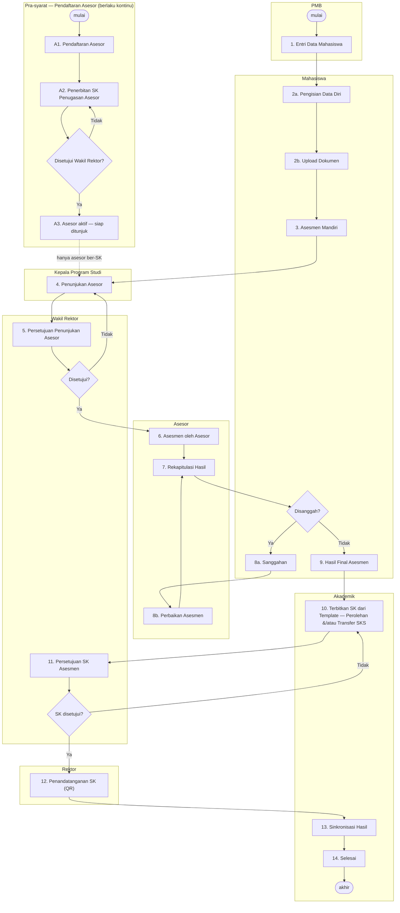

# Alur Proses RPL — Sistem Informasi RPL Terpadu ITI

Dokumen ini merangkum alur bisnis Rekognisi Pembelajaran Lampau (RPL) sebagaimana
**yang benar-benar diimplementasikan di kode**, bukan sekadar rancangan. Setiap tahap
dipetakan ke: aktor, halaman, aksi di UI, data yang tersimpan, dan status yang dihasilkan.

Sumber utama penelusuran:

- `src/components/proses-bisnis/ProsesBisnisComponent.tsx` — diagram proses bisnis resmi
- `src/app/api/protected/status/route.ts` — mesin status (13 tahap)
- `src/services/Status/StatusService.tsx` — pemicu perpindahan status
- `prisma/schema.prisma` — model data
- `src/stores/MenuStore.tsx` — pemetaan peran ↔ menu
- `doc/panduan-api-nomor-surat.md` — API nomor surat Sisurat ITI
- `doc/panduan-integrasi-nextjs.md` — API QR Code Generator ITI

---

## 1. Aktor

| Peran | Tanggung jawab utama |
|---|---|
| **PMB** | Entri data calon mahasiswa RPL (titik awal seluruh proses) |
| **Mahasiswa** | Melengkapi data diri, unggah dokumen bukti, memilih mata kuliah, evaluasi mandiri, mengajukan sanggahan |
| **Kaprodi** | Mendaftarkan asesor dan menunjuk 2 asesor untuk tiap pendaftaran |
| **Wakil Rektor** | Menyetujui SK penugasan asesor, penunjukan asesor, dan hasil final asesmen |
| **Akademik** | Menerbitkan SK penugasan asesor & SK hasil asesmen, sinkronisasi, penutupan |
| **Rektor** | Menandatangani SK hasil asesmen secara elektronik (QR verifikasi) |
| **Asesor** | Menilai bukti per capaian pembelajaran, ekuivalensi transfer SKS, rekapitulasi |
| **Admin** | Master data (prodi, mata kuliah, capaian, jenis dokumen, status, role, template) |

Satu berkas proses = satu baris **`Pendaftaran`** (`pendaftaran_id`). Seluruh status,
dokumen, mata kuliah, dan SK menggantung pada entitas ini.

---

## 2. Diagram Alur



---

## 3. Mesin Status

Status pendaftaran disimpan di `status_mahasiswa_assesment_history` (relasi ke
`status_mahasiswa_assesment`), dengan tepat satu baris ber-`Aktif = true`.

Perpindahan status dilakukan lewat satu endpoint: **`GET /api/protected/status?p=<PendaftaranId>&j=<kode>`**.
Perilakunya (lihat `src/app/api/protected/status/route.ts`):

1. Kode `j` menentukan **daftar status kumulatif** sampai tahap tersebut.
2. Status yang belum ada akan dibuat; status terakhir ditandai `Aktif = true`.
3. **Status yang urutannya melewati tahap target akan dihapus** — inilah mekanisme mundur
   (rollback) ketika sebuah pengajuan ditolak.
4. Status yang tidak lagi ada pada daftar urutan (mis. "Penerbitan SK Penugasan Asesor" yang
   kini dipindah ke pendaftaran asesor) ikut dibersihkan dari riwayat berkas lama.

Ke-13 status dan pemicunya:

| # | Status | Kode `j` | Dipicu oleh | Dari halaman |
|---|---|---|---|---|
| 1 | Pengisian Data Diri | `pdd` | PMB menyimpan calon mahasiswa baru | `/manajemen-data/mahasiswa` |
| 2 | Asessmen Mandiri | `am` | Mahasiswa menekan "Mulai Evaluasi" | `/mata-kuliah/evaluasi-mandiri` |
| 3 | Penunjukan Asesor | `pa` | Mahasiswa menekan "Lanjutkan ke Asesor" | `/mata-kuliah/finalisasi` |
| 4 | Persetujuan Penunjukan Asesor | `ppa` | Kaprodi menyimpan Asesor 1 & 2 | `/asesor/penunjukan-asesor` |
| 5 | Asessmen Oleh Asesor | `aoa` | Wakil Rektor menyetujui penunjukan asesor | `/approval/asesor` |
| 6 | Rekapitulasi Asessmen | `ra` | Asesor menekan "Lanjutkan ke Rekapitulasi" | `/asessment/asessmen-mahasiswa` |
| 7 | Sanggahan | `s` | Asesor menekan "Lanjutkan ke Sanggahan" | `/asessment/rekapitulasi` |
| 8 | Hasil Final Asessmen | `hfa` | Sanggahan ditutup | `/asessment/sanggahan-mahasiswa/[id]` |
| 9 | Penerbitan SK Asessmen | `psa` | Wakil Rektor menolak SK sehingga kembali ke Akademik untuk direvisi | `/approval/sk-hasil` |
| 10 | Persetujuan SK Asessmen | `pska` | Akademik menekan "Ajukan ke Wakil Rektor" setelah SK terbit | `/asessment/hasil-asessmen/[id]`, `/asessment/sk-rektor/[id]` |
| 11 | Penandatanganan SK | `pts` | Wakil Rektor menyetujui **seluruh** SK mahasiswa itu | `/approval/sk-hasil` |
| 12 | Sinkronisasi Hasil Asessmen | `sha` | Rektor menandatangani **seluruh** SK mahasiswa itu | `/tanda-tangan` |
| 13 | Selesai | `done` | Akademik menjalankan sinkronisasi | `/asessment/sinkronisasi` |

Setiap perubahan status otomatis menjadi notifikasi bagi mahasiswa
(`/api/protected/notifikasi` membaca `status_mahasiswa_assesment_history`).

---

## 4. Pra-syarat: SK Penugasan Asesor (Berlaku Kontinu)

SK penugasan asesor **bukan bagian dari alur RPL per mahasiswa**. SK diterbitkan sekali saat
asesor didaftarkan dan berlaku kontinu selama asesor bertugas.

1. **Pendaftaran asesor** — Kaprodi menambahkan asesor di `/manajemen-data/asesor`
   (`Asesor` + `AsesorAkademik`/`AsesorPraktisi` + `AsesorProgramStudi`).
2. **Penerbitan SK** — Akademik membuka `/asesor/sk-rektor` (menu **Asesor → Sk. Rektor**)
   → tombol **Terbitkan SK** (membuka `/asesor/sk-rektor/baru`),
   mengisi Nama/Nomor/Tahun SK, mengunggah berkas, dan memilih asesor yang dicakup
   (satu SK dapat mencakup banyak asesor). Tersimpan sebagai `SkRektor` bertipe `Asesor`
   dengan relasi `SkRektorAssesor` → `Asesor`. Asesor menerima notifikasi WhatsApp.
3. **Persetujuan** — Wakil Rektor menyetujui di `/approval/sk-asesor`
   (`SkRektor.Disetujui`, `DisetujuiPada`, `DisetujuiOleh`, catatan). SK yang sudah
   disetujui terkunci — perubahan penugasan dilakukan dengan menerbitkan SK baru.
4. **Asesor aktif** — hanya asesor dengan SK berstatus disetujui yang dapat dipilih pada
   daftar penunjukan Kaprodi (yang belum ber-SK tetap terlihat tapi nonaktif), dan
   penyimpanan penunjukan ditolak server bila salah satu asesor belum ber-SK sah.

---

## 5. Tahap demi Tahap

### Tahap 1 — Entri Data Mahasiswa (PMB)

Halaman `/manajemen-data/mahasiswa` → `POST /api/protected/manajemen-data/mahasiswa?jenis=set-user`.

Dalam satu aksi, sistem membuat: `Alamat` → `User` → `Userlogin` (username & password awal
di-*generate* dari kode pendaftar/no. ujian/jalur/NIM) → role **Mahasiswa** → `Mahasiswa` →
`Pendaftaran` → `DaftarUlang` → `InformasiKependudukan`, lalu menandai status
**Pengisian Data Diri** sebagai aktif.

Data pendaftaran mencakup: `KodePendaftar`, `NoUjian`, `Periode`, `Gelombang`,
`JalurPendaftaran`, `SistemKuliah` (`RPL` / `REGULER`).

### Tahap 2a — Pengisian Data Diri (Mahasiswa)

- `/profil` — data pribadi, kontak, alamat.
- `/kelengkapan-informasi/*` — 10 submenu: institusi lama, pendidikan, pekerjaan,
  organisasi profesi, orang tua, pelatihan profesional, konferensi/seminar,
  kejuaraan/piagam, pesantren, kependudukan.

### Tahap 2b — Upload Dokumen (Mahasiswa)

Halaman `/upload-dokumen`. Dokumen disimpan sebagai `BuktiForm` (biner di kolom `FileData`)
mengacu ke master `JenisDokumen`.

Setiap unggahan diproses **AI OCR** (default model `alibaba/qwen3-vl-instruct`), hasilnya
disimpan per halaman di `BuktiFormPages` (`Prompt`, `Result` JSON, `Think`). Khusus dokumen
transkrip, hasil OCR langsung dipakai untuk mengisi tabel `TranskripNilai`
(kode MK, nama MK, SKS, nilai dari PT asal). Pemakaian token tercatat di `AiTokenUsage`.

### Tahap 3 — Asesmen Mandiri (Mahasiswa)

Empat submenu berurutan di `/mata-kuliah`:

1. **Pemilihan** — memilih mata kuliah yang diajukan RPL, tiap MK ditandai
   `Transfer_SKS` (dari PT asal) atau `Perolehan_SKS` (dari pengalaman) → `MataKuliahMahasiswa`.
2. **Ekuivalen Check** — melihat pasangan MK transfer dengan transkrip PT asal
   (pencocokan finalnya dinilai asesor).
3. **Evaluasi Mandiri** — untuk tiap `CapaianPembelajaran` mata kuliah, mahasiswa menilai diri
   (`SANGAT_BAIK` / `BAIK` / `TIDAK_PERNAH`) dan melampirkan bukti → `EvaluasiDiri` +
   `BuktiFormEvaluasiDiri`. Aksi ini menyetel status **Asessmen Mandiri**.
4. **Finalisasi** — tombol "Lanjutkan ke Asesor" mengunci berkas dan menyetel status
   **Penunjukan Asesor**. Setelah titik ini form evaluasi mandiri menjadi *read-only*.

### Tahap 4 — Penunjukan Asesor (Kaprodi)

Halaman `/asesor/penunjukan-asesor`. Kaprodi memilih **2 asesor berbeda** dari daftar asesor
program studi (`AsesorProgramStudi`) → `AssesorMahasiswa` (`Urutan` 1 & 2, `Confirmation = false`).
Status berpindah ke **Persetujuan Penunjukan Asesor**.

Seluruh asesor program studi tetap ditampilkan, namun yang **SK penugasannya belum
disetujui** (lihat §4) ditandai *"SK belum disetujui"* dan tidak dapat dipilih; bila tidak
ada satu pun yang ber-SK sah, muncul peringatan berisi langkah yang harus ditempuh.
Percobaan menyimpan penunjukan dengan asesor tanpa SK sah tetap ditolak API dengan HTTP 400.

Asesor sendiri bertipe akademik (`AsesorAkademik`) atau praktisi (`AsesorPraktisi`).

### Tahap 5 — Persetujuan Penunjukan Asesor (Wakil Rektor)

Halaman `/approval/asesor`. Menyetujui → `AssesorMahasiswa.Confirmation = true` dan status
langsung maju ke **Asessmen Oleh Asesor**. Jika penunjukan tidak disetujui, status
dikembalikan ke **Penunjukan Asesor** sehingga Kaprodi menunjuk ulang.

### Tahap 6 — Asesmen oleh Asesor

Halaman `/asessment/asessmen-mahasiswa` dengan dua jenis pemeriksaan:

- **Asesmen Check** (`/asessmen-check/[id]`) — per capaian pembelajaran, asesor memutuskan
  4 kriteria bukti: **Valid, Autentik, Terkini, Memadai** + nilai 0–100 + ringkasan
  → `HasilAssesmen`. Tersedia bantuan AI (`HasilAssesmenAi`) yang memberi justifikasi
  berbasis ringkasan OCR bukti; keputusan akhir tetap milik asesor.
- **Ekuivalent Check** (`/ekuivalent-check/[id]`) — memasangkan `TranskripNilai` PT asal
  dengan `MataKuliahMahasiswa` beserta nilai dan tanda `Diakui` → `TranskripNilaiRelation`.

Skor per mata kuliah direkam di `SkorAssesmen`: **Portofolio, Tulis, Wawancara, Demo** →
rata-rata → `NilaiHuruf` → `Diakui`.

Setelah selesai, asesor menekan "Lanjutkan ke Rekapitulasi" (status **Rekapitulasi Asessmen**).

### Tahap 7 — Rekapitulasi Hasil (Asesor)

Halaman `/asessment/rekapitulasi/[id]`. Rangkuman seluruh mata kuliah, skor, dan kelulusan
RPL; dapat dicetak sebagai PDF (form asesmen, berita acara, rekapitulasi) memakai template
dari **Template Builder**. Tombol lanjut menyetel status **Sanggahan** — yaitu membuka
jendela sanggah bagi mahasiswa.

### Tahap 8 — Sanggahan (Mahasiswa ↔ Asesor)

Halaman `/asessment/sanggahan-mahasiswa/[id]`. Mahasiswa dapat mengajukan keberatan atas
mata kuliah tertentu → `SanggahanAssesmen` (flag `ProsesBanding`, `DiskusiBanding`),
`SanggahanAssesmenMk` (MK yang disanggah + keterangan), dan `SanggahanAssesmenPihak`
(pihak yang terlibat: nama, jabatan, instansi).

Status mata kuliah (`StatusMataKuliahMahasiswa`) bergerak antara `DALAM_ASESSMEN` →
`DISANGGAH` → `PERLU_DIREVISI` → `SELESAI`. Asesor memperbaiki penilaian lalu kembali ke
rekapitulasi. Bila tidak ada (atau selesai) sanggahan, status menjadi **Hasil Final Asessmen**.

### Tahap 9 — Hasil Final & Penerbitan SK (Akademik)

Halaman `/asessment/hasil-asessmen/[id]`. Akademik memeriksa rekap hasil asesmen, lalu
menerbitkan SK dari template. **Kedua jenis SK selalu ditawarkan** — SK Perolehan SKS dan
SK Transfer SKS — dan Akademik bebas menerbitkan salah satu atau keduanya sesuai kebutuhan
mahasiswa. Tiap kartu menampilkan jumlah mata kuliah mahasiswa untuk jenis tersebut sebagai
keterangan, bukan sebagai pembatas.

Tombol **"Ajukan ke Wakil Rektor"** aktif setelah minimal satu SK terbit dan memindahkan
status langsung ke **Persetujuan SK Asessmen** — tidak ada langkah Akademik tambahan di
antaranya. Kartu penerbitan tetap terbuka selama berkas ada di tangan Akademik, yaitu pada
status *Hasil Final Asessmen* maupun *Penerbitan SK Asessmen* (keadaan setelah SK ditolak
Wakil Rektor).

### Tahap 10 — Penerbitan SK Hasil Asesmen (Akademik)

Halaman `/asessment/sk-rektor/[id]`. SK **dibuat dari template**, bukan diunggah manual.
Endpoint unggah berkas SK sudah dicabut: `POST /api/protected/asessment/sk-rektor` tanpa
`?jenis=terbitkan` membalas HTTP 400.

Ada dua jenis SK — **SK Perolehan SKS** dan **SK Transfer SKS** — dan keduanya selalu
tersedia untuk diterbitkan. Akademik yang memutuskan: salah satu saja, atau keduanya.
Jumlah `MataKuliahMahasiswa` per `Keterangan` (`Perolehan_SKS` / `Transfer_SKS`) ditampilkan
sebagai keterangan di tiap kartu, tetapi tidak membatasi — server tidak menolak penerbitan
untuk jenis yang mata kuliahnya nol.

Halaman ini dan halaman hasil asesmen (Tahap 9) memakai kartu penerbitan yang sama dan
endpoint yang sama; menerbitkan ulang menimpa SK jenis tersebut, bukan membuat SK baru.
Halaman ini dipakai terutama ketika SK **dikembalikan** Wakil Rektor untuk direvisi —
berkas dengan status *Penerbitan SK Asessmen* muncul di daftarnya.

Nomor SK yang diisi Akademik di tahap ini bersifat **sementara** — nomor resmi baru terbit
dari Sisurat saat Rektor menandatangani (lihat Tahap 12).

Setiap penerbitan mengisi Nama/Nomor/Tahun SK, lalu sistem merender PDF lewat
`/api/protected/generate-pdf?_t=sk` memakai template SK Hasil (Perolehan/Transfer) dari
**Template Builder**, dan menyimpannya sebagai `SkRektor` (`JenisSkAsessmen` terisi) yang
ditautkan ke pendaftaran lewat `SkRektorMahasiswa`. Menerbitkan ulang menimpa berkas dan
membatalkan persetujuan sebelumnya.

Tombol **"Ajukan ke Wakil Rektor"** aktif setelah minimal satu SK terbit, dan memindahkan
status ke **Persetujuan SK Asessmen**.

### Tahap 11 — Persetujuan SK Asesmen (Wakil Rektor)

Halaman `/approval/sk-hasil`. Setiap SK dinilai **satu per satu**:

- **Disetujui** → `SkRektor.Disetujui = true`. Bila seluruh SK milik mahasiswa itu sudah
  disetujui, status maju ke **Penandatanganan SK**; bila masih ada yang menunggu, berkas
  tetap di tahap ini.
- **Tidak disetujui** → catatan tersimpan di `SkRektor.Catatan` dan status dikembalikan ke
  **Penerbitan SK Asessmen** agar Akademik merevisi lalu menerbitkan ulang.

### Tahap 12 — Penandatanganan SK (Rektor)

Halaman `/tanda-tangan`, hanya dapat diakses peran **Rektor** (dijaga di UI lewat menu dan
di server lewat pemeriksaan peran pada `/api/protected/tanda-tangan`).

Daftar berisi **tiap SK** (bukan tiap mahasiswa) yang sudah disetujui Wakil Rektor dan
berstatus **Penandatanganan SK**, sehingga mahasiswa dengan dua SK muncul dua baris.
Rektor membuka detail,
melakukan pratinjau dokumen SK yang diunggah Akademik, memilih pejabat penandatangan, lalu
menekan **Tandatangani**. Yang terjadi kemudian (`POST /api/protected/tanda-tangan`):

1. **Nomor surat resmi diminta lebih dulu ke Sisurat ITI**
   (`POST /api/external/v1/nomor-surat`, `letterType: SURAT_KEPUTUSAN`, `unitKode: Rek`),
   mengikuti `doc/panduan-api-nomor-surat.md`. Kredensial `clientId`/`clientSecret` dibaca
   dari environment di sisi server, token JWT berlaku 24 jam dan di-*cache* per proses.
   Nomor yang terbit **langsung disimpan** ke `SkRektor.NomorSuratSisurat` sebelum langkah
   berikutnya, karena deret Sisurat tidak dapat dibatalkan — bila penandatanganan diulang,
   nomor yang sama dipakai kembali, bukan menerbitkan nomor baru.
2. SK **dirender ulang dari template** memakai nomor resmi tersebut, sehingga nomor tercetak
   pada badan dokumen (bukan tempelan) menggantikan nomor sementara dari Akademik.
3. Baru setelah itu sistem memanggil **QR Code Generator ITI** (`POST /api/documents.php`)
   dengan `official_id`, `doc_number` = nomor Sisurat, `doc_title` (Nama SK), dan `doc_date`.
   Integrasi mengikuti `doc/panduan-integrasi-nextjs.md`: seluruh pemanggilan dilakukan di
   sisi server, kredensial diambil dari `QR_API_BASE_URL`, `QR_API_USERNAME`,
   `QR_API_PASSWORD`, dan token login (berlaku 24 jam) di-*cache* per proses.
4. `qrcode_base64` yang dikembalikan ditempel ke **pojok kanan bawah halaman terakhir** PDF
   SK, lengkap dengan keterangan nama pejabat, nomor surat, dan URL verifikasi
   (`src/lib/sk-signature.ts`).
5. Berkas hasil menimpa `SkRektor.FileData` sehingga PDF bernomor resmi + ber-QR menjadi
   versi baku yang dibaca semua peran (Mahasiswa, Asesor, Akademik).
6. Data tanda tangan dicatat: `NomorSk` (nomor resmi), `NomorSuratSisurat`,
   `NomorSuratPada`, `Ditandatangani`, `TandaTanganPada`, `TandaTanganOleh`, `QrToken`,
   `QrVerifyUrl`, `QrDocumentId`, `QrOfficialId`, `QrOfficialNama`, `QrOfficialJabatan`.
7. Setelah **seluruh** SK milik mahasiswa itu ditandatangani, status berpindah ke
   **Sinkronisasi Hasil Asessmen**. Mahasiswa **belum** dikabari di titik ini — SK masih
   ditahan sampai Akademik mempublikasikannya (lihat Tahap 13).

**Penguncian.** Setelah `Ditandatangani = true`, `POST /api/protected/asessment/sk-rektor`
menolak penggantian berkas (HTTP 409) dan endpoint tanda tangan menolak penandatanganan
ulang. Isian formulir PDF juga di-*flatten* agar nilainya tidak dapat diubah lagi.
Keaslian SK dapat dicek publik lewat `verify_url` pada QR.

### Tahap 13 — Publikasi SK ke Mahasiswa (Akademik)

Halaman `/asessment/sk-rektor`. SK yang sudah ditandatangani Rektor **tidak otomatis
terlihat mahasiswa**; Akademik yang memutuskan kapan dipublikasikan.

- Kolom **Publikasi** menampilkan `Belum ditandatangani` / `Ditahan` / `Dipublikasikan`.
- Aksi **Publikasikan SK ke Mahasiswa** menandai seluruh SK pendaftaran itu
  (`SkRektor.Dipublikasikan`) dan mengirim pemberitahuan WhatsApp ke mahasiswa.
- Aksi **Tahan Publikasi SK** mengembalikannya agar tersembunyi lagi.
- Server menolak publikasi bila masih ada SK yang belum ditandatangani Rektor (HTTP 409).

Mahasiswa dan asesor hanya melihat serta mengunduh SK yang sudah dipublikasikan.

### Tahap 14 — Sinkronisasi & Selesai (Akademik)

Halaman `/asessment/sinkronisasi`. Akademik memilih beberapa pendaftaran sekaligus dan
menjalankan proses (dengan indikator progres); tiap pendaftaran ditandai **Selesai**.
Daftar berkas yang tuntas ada di `/asessment/selesai`.

---

## 6. Jalur Mundur (Rollback)

| Kondisi | Status kembali ke | Konsekuensi |
|---|---|---|
| Wakil Rektor menolak SK penugasan asesor | — (di luar alur RPL) | Akademik memperbaiki SK; asesor belum bisa ditunjuk |
| Wakil Rektor menolak penunjukan asesor | Penunjukan Asesor | Kaprodi menunjuk ulang |
| Mahasiswa mengajukan sanggahan | Sanggahan | Asesor memperbaiki lalu rekapitulasi ulang |
| Wakil Rektor menolak salah satu SK | Penerbitan SK Asessmen | Akademik merevisi lalu menerbitkan ulang SK tersebut |

Karena endpoint status menghapus semua riwayat di atas tahap target, mundurnya status juga
menghapus jejak tahap-tahap sesudahnya.

---

## 7. Penyimpanan Berkas

Berkas **tidak** disimpan sebagai bytes di basis data. Semua berkas milik pengguna ditulis
ke folder penyimpanan dan basis data hanya memegang path relatifnya.

```
storage/                                  ← STORAGE_ROOT (dapat diubah lewat env)
└── <userId>/
    ├── dokumen/<uuid>.pdf                ← bukti_form.path_file
    ├── sk/<uuid>.pdf                     ← sk_rektor.path_file (SK hasil asesmen)
    ├── avatar/avatar.png                 ← user.avatar
    └── tiket/<uuid>.pdf                  ← tickets_file.path_file
storage/sk/<uuid>.pdf                     ← SK penugasan asesor (tanpa pemilik tunggal)
```

| Tabel | Kolom | Isi |
|---|---|---|
| `bukti_form` | `path_file` | `<userId>/dokumen/<namaFile>` |
| `sk_rektor` | `path_file` | `<userId>/sk/<namaFile>` atau `sk/<namaFile>` |
| `tickets_file` | `path_file` | `<userId>/tiket/<namaFile>` |
| `user` | `avatar` | `<userId>/avatar/avatar.png` |

Seluruh operasi berkas lewat `src/lib/storage.ts` (`simpanBerkas`, `bacaBerkas`,
`berkasAda`, `hapusBerkas`), yang menolak path di luar akar penyimpanan (path traversal).
Gambar setelan situs (`setting_*`) sengaja tetap di basis data karena tidak dimiliki
pengguna tertentu.

Untuk memindahkan basis data lama yang masih menyimpan bytes:

```bash
npx tsx scripts/pindah-berkas-ke-storage.ts   # salin bytes ke /storage
npx prisma migrate deploy                     # ganti kolom bytes jadi kolom path
```

---

## 8. Entitas Data Inti

```
Pendaftaran (1 berkas RPL)
├── StatusMahasiswaAssesmentHistory   → posisi berkas dalam 13 tahap
├── BuktiForm ──> BuktiFormPages      → dokumen (di /storage) + hasil AI OCR
├── TranskripNilai ──> TranskripNilaiRelation → ekuivalensi transfer SKS
├── MataKuliahMahasiswa               → MK yang diajukan (Transfer/Perolehan SKS)
│   ├── EvaluasiDiri ──> HasilAssesmen ──> HasilAssesmenAi
│   └── SkorAssesmen ──> SkorAssesmenAi
├── AssesorMahasiswa                  → penugasan asesor per pendaftaran
├── SanggahanAssesmen ──> SanggahanAssesmenMk / ...Pihak
└── SkRektorMahasiswa ──> SkRektor                       (SK hasil asesmen: Perolehan &/atau
                                                          Transfer SKS + tanda tangan QR +
                                                          status publikasi)
```

---

## 9. Peta Menu per Peran

| Peran | Menu utama |
|---|---|
| Mahasiswa | Kelengkapan Informasi, Upload Dokumen, Mata Kuliah, Asessment (asesmen, rekapitulasi, sanggahan, hasil, SK) |
| Kaprodi | Manajemen Data (pengguna, asesor), Manajemen Pembelajaran, Asesor (penunjukan, SK) |
| Wakil Rektor | Asesor, Approval (persetujuan SK asesor, persetujuan asesor, persetujuan SK hasil) |
| Asesor | Asessment (asesmen, rekapitulasi, sanggahan, hasil, SK) |
| Akademik | Asessment (hasil, SK Rektor, sinkronisasi, selesai) |
| Rektor | Tanda Tangan (`/tanda-tangan`) |
| PMB | Manajemen Data (mahasiswa, pengguna), Manajemen Area, Manajemen Pembelajaran |
| Admin | Seluruh master data, Website, Manajemen Sistem, Template Builder |

Sumber: `src/stores/MenuStore.tsx`. Menu difilter dari nama role, dan role aktif dapat
ditukar lewat *switcher* di sidebar (tersimpan di `localStorage` kunci `pmb.iti.role`).

---

## 10. Catatan Implementasi

Beberapa hal yang ditemukan saat menelusuri kode — perlu diketahui sebelum dokumen ini
dijadikan acuan operasional:

1. **Seed sudah disamakan dengan alur.** `prisma/seed.ts` kini mengisi ke-14 status sesuai
   `orderedStatus` di `src/app/api/protected/status/route.ts` (sebelumnya 7 status usang),
   lengkap dengan ikon dan urutannya.
2. **Nama role di seed sudah berkapital** (`Admin`, `PMB`, `Kaprodi`, …) agar cocok dengan
   pencocokan di `MenuStore`, dan role `Wakil Rektor` ditambahkan — sebelumnya seed memakai
   huruf kecil dan tidak memuat peran tersebut.
3. **Tabel `sk_rektor_assesor` dibangun ulang** untuk menunjuk `asesor_id`, bukan
   `assesor_mahasiswa_id`. Penautan SK lama (jika ada) hilang saat migrasi dijalankan.
   Pada kode sebelumnya baris penghubung ini praktis tidak pernah dibuat — blok
   `createMany` di `approval/asesor` masih dikomentari — sehingga dampaknya minim.
4. **Sinkronisasi belum terhubung ke sistem luar.** Endpoint `asessment/sinkronisasi` hanya
   menyediakan `GET` (daftar); aksi "sinkronisasi" di UI sebatas menandai status *Selesai*.
   Integrasi ke sistem akademik/Feeder belum ada.
5. **Perpindahan status dipicu dari sisi klien** lewat `GET` tanpa validasi transisi di
   server: endpoint menerima kode tahap apa pun dan langsung menulis riwayat. Tidak ada
   pengecekan peran maupun urutan yang sah di level API status.
6. **Penolakan belum tercatat pada persetujuan asesor.** Pada `/approval/asesor`, catatan
   penolakan (`catatan`) dikirim tetapi tidak disimpan — blok penyimpanannya masih
   dikomentari di `src/app/api/protected/approval/asesor/route.ts`. Rollback status pada
   komponen approval juga dijalankan di cabang `catch` (kegagalan jaringan), bukan pada
   kondisi "tidak disetujui".
7. **Status "Penerbitan SK Penugasan Asesor" sudah dipensiunkan** dan baris masternya sudah
   dihapus dari basis data (2 baris riwayat ikut terhapus, tidak ada berkas yang kehilangan
   status aktif).
8. **Dua status baru sudah ada di basis data**: `Persetujuan SK Asessmen` (urutan 11) dan
   `Penandatanganan SK` (urutan 12); seluruh 14 status kini bernomor 1–14 sesuai alur. Tahap ini baru dan
   belum ada di basis data lama. Tambahkan satu baris di `/manajemen-data/status` dengan
   nama persis **`Penandatanganan SK`** dan `Urutan` di antara "Penerbitan SK Asessmen" dan
   "Sinkronisasi Hasil Asessmen". Tanpa baris ini, endpoint status akan menolak permintaan
   dengan pesan yang jelas (penjagaan baru) alih-alih membuat pendaftaran kehilangan status
   aktif.
9. **SK Penugasan Asesor masih diunggah manual.** Template Builder baru memuat template
   Form Asessmen, Berita Acara, Rekapitulasi, dan SK Hasil (Perolehan/Transfer), sehingga
   SK penugasan asesor di `/asesor/sk-rektor` belum bisa dirender dari template.
10. **Penandatanganan hanya menerima PDF.** Unggahan SK masih mengizinkan doc/docx, tetapi
   penempelan QR hanya bekerja pada PDF; permintaan tanda tangan atas berkas non-PDF ditolak
   dengan pesan agar Akademik mengunggah ulang dalam bentuk PDF.
11. **`pdf-lib` tidak mendukung enkripsi/permission PDF.** "Terkunci" karena itu ditegakkan di
   aplikasi (berkas tidak dapat diganti setelah ditandatangani) plus *flatten* formulir,
   bukan lewat proteksi bawaan PDF.
12. **Ada `StatusMahasiswaAssesmentId` bernilai dummy** yang di-*hardcode* di beberapa
   komponen (mis. `3b610de5-…-29e1d954d40f`) untuk memutakhirkan tampilan lokal setelah
   aksi. Nilai ini tidak dipakai untuk penulisan basis data, tetapi menyesatkan bila dibaca
   sebagai ID sungguhan.
